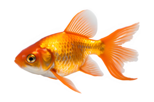

# home work

*Список команд и флагов программы git, которые были разучены при работе над проектом.*

1. **Создание репозитория.**
    - git init
2. **Основы конфигурации.**
    - git config --global user.name "Oleg Vologa"
    - git config --global user.name oleg.vologa@mail.ru
    - git config --list
    - git config --global core.editor "code --wait"
    - git config -home
    - git help config
3. **Узнать статус файлов.**
    - git status
4. **Проиндексировать файл.**
    - git add index.html
5. **Проиндексировать все файлы в папке проекта.**
    - git add .
6. **Сделать коммит.**
    - git commit -m 'Add file index.html'
7. **Показать текущий коммит.**
    - git show
8. **Показать текущий коммит со всеми подробностями.**
    - git show --pretty=fuller
9. **Коммит без git add**
    - git commit -am 'Rename hello to helloGit!'
    - git commit -m 'Ignore file' .gitignore
10. **Удаление и переименовывание файлов**
    - git commit -m Clean up
    - git rm -r src
    - git rm -r --cached src
    - git rm -f index.html

### пример ссылки

[this project](https://github.com/OlegVologa/home-work.git)

### пример картинки

